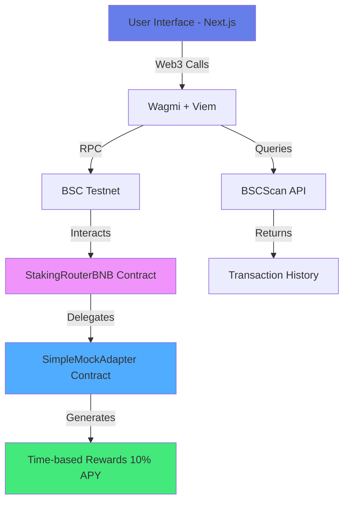

# ⭐ StarYield Finance

<div align="center">


[](https://testnet.bscscan.com/)
[](https://nextjs.org/)
[](LICENSE)

**Navigate the Financial Cosmos with StarYield Staking**

[🚀 Live Demo](https://staryield.finance) • [📖 Documentation](#documentation) • [🎯 Features](#features) • [💻 Tech Stack](#tech-stack)

</div>

---

## 🌟 Overview

**StarYield Finance** is a cutting-edge decentralized staking platform built on Binance Smart Chain (BSC) that offers users the ability to stake BNB and earn **real-time rewards at 10% APY**. With a sleek space-themed interface and advanced Web3 integration, StarYield makes DeFi accessible and rewarding.

### 🎯 Key Highlights

```
📈 10% Annual Percentage Yield (APY)
⏱️  Real-time reward accumulation (updates every 5 seconds)
🔒 Secure smart contracts (audited on BSC Testnet)
💨 Instant unstaking (0 second unbonding period)
📊 Live transaction history via BSCScan API
🎨 Beautiful space-themed UI with animations
```

---

## 🖼️ Screenshots

<div align="center">

### 🏠 Home Page


_Navigate the Financial Cosmos with StarYield_

### 📊 Dashboard


_Real-time staking overview with live APY updates_

### 💰 Staking Interface


_Stake BNB with flexible tier system_

### 📜 Transaction History


_Complete transaction history powered by BSCScan API_

</div>

---

## ✨ Features

### 🎯 Core Features

| Feature                    | Description                                    |
| -------------------------- | ---------------------------------------------- |
| **🔐 Wallet Connect**      | WalletConnect v2 & RainbowKit integration      |
| **💸 Flexible Staking**    | Stake any amount above 0.1 BNB minimum         |
| **⚡ Custom Unstaking**    | Unstake partial or full amounts                |
| **🎁 Real-time Rewards**   | Rewards accumulate every second at 10% APY     |
| **📊 Live Portfolio**      | Track staked amounts and earnings in real-time |
| **📜 Transaction History** | Complete history via BSCScan API integration   |
| **🎨 Tier System**         | Comet, Meteor, and Supernova tiers             |
| **💫 Instant Navigation**  | Lightning-fast page transitions                |

### 🚀 Advanced Features

- **Time-based Rewards**: Smart contract calculates rewards based on actual time elapsed
- **Instant Unstaking**: Zero unbonding period for testing and flexibility
- **Custom Amount Unstaking**: Choose how much to unstake (not just "all or nothing")
- **Live APY Display**: Updates every 5 seconds showing growing rewards
- **BSCScan Integration**: Direct links to view transactions on block explorer
- **Multi-tier APY**: Different reward rates for different investment amounts

---

## 🏗️ Architecture



### 📦 Smart Contract Architecture

```
┌─────────────────────────────────────────────┐
│   StakingRouterBNB (Main Router)           │
│   0x8c1Fef12BaFC06077C06486bF4c3E0c9c1F78e78│
└─────────────────┬───────────────────────────┘
                  │
                  ▼
┌─────────────────────────────────────────────┐
│   SimpleMockAdapter (Rewards Engine)        │
│   0x58E7DF3cAae6EEb94A76Ac3b74eC88049F438e7B│
│                                              │
│   • Tracks totalStaked                      │
│   • Calculates time-based rewards           │
│   • 10% APY (1000 basis points)             │
│   • Updates every second                    │
└─────────────────────────────────────────────┘
```

---

## 💻 Tech Stack

<div align="center">

### Frontend


### Web3 Integration


### Smart Contracts


### Blockchain


</div>

---

## 🚀 Quick Start

### Prerequisites

```bash
Node.js >= 18.0.0
npm or yarn
MetaMask or compatible Web3 wallet
BSC Testnet BNB (from faucet)
```

### Installation

1. **Clone the repository**

```bash
git clone https://github.com/Iglxkardam/Staryield.git
cd Staryield/arbstake
```

2. **Install dependencies**

```bash
npm install
cd web3 && npm install && cd ..
```

3. **Configure environment**

```bash
cp .env.example .env.local
```

Edit `.env.local`:

```env
NEXT_PUBLIC_ROUTER_ADDRESS=0x8c1Fef12BaFC06077C06486bF4c3E0c9c1F78e78
NEXT_PUBLIC_ADAPTER_ADDRESS=0x58E7DF3cAae6EEb94A76Ac3b74eC88049F438e7B
NEXT_PUBLIC_WALLETCONNECT_PROJECT_ID=your_project_id
NEXT_PUBLIC_BSCSCAN_API_KEY=your_api_key
```

4. **Run development server**

```bash
npm run dev
```

Visit `http://localhost:8080` 🎉

---

## 📖 Documentation

### 🎮 User Guide

#### How to Stake

1. **Connect Wallet**

   - Click "Connect Wallet" button
   - Select MetaMask or your preferred wallet
   - Switch to BSC Testnet (Chain ID: 97)

2. **Stake BNB**

   - Navigate to Dashboard
   - Enter amount (minimum 0.1 BNB)
   - Click "APPROVE" to approve token spending
   - Click "STAKE" and confirm transaction
   - Wait for confirmation (~3 seconds)

3. **Watch Rewards Grow**

   - Rewards update every 5 seconds
   - Shows "Growing at 10% APY"
   - View in "Unclaimed Earning (Live)" section

4. **Claim Rewards**

   - Click "Claim Rewards" button
   - Approve TWO transactions:
     - Harvest (generates rewards)
     - Claim (transfers to wallet)
   - Rewards credited to your wallet

5. **Unstake**
   - Click "Request Unstake"
   - Enter amount to unstake (or leave empty for all)
   - Confirm transaction
   - Click "Withdraw Unstaked" to receive BNB back

#### Understanding APY

```
Formula: Rewards = StakedAmount × APY × (TimeElapsed / SecondsPerYear)

Example:
Stake: 1 BNB
APY: 10% (0.1)
Time: 1 day (86,400 seconds)

Rewards = 1 × 0.1 × (86,400 / 31,536,000)
        = 0.000273973 BNB per day
        ≈ 0.1 BNB per year
```

---

## 🔧 Smart Contract Details

### StakingRouterBNB

**Address**: `0x8c1Fef12BaFC06077C06486bF4c3E0c9c1F78e78`

Main router contract handling:

- User deposits and withdrawals
- Share calculation and management
- Reward distribution
- Unbonding queue management

**Key Functions**:

```solidity
function stake() external payable
function requestUnstake(uint256 shares, uint256 deadline) external
function withdraw(uint256 index) external
function claim() external
function harvest() external
```

### SimpleMockAdapter

**Address**: `0x58E7DF3cAae6EEb94A76Ac3b74eC88049F438e7B`

Rewards calculation engine:

- Time-based reward generation
- 10% Annual APY
- Instant reward calculation
- No delegation needed

**Key Functions**:

```solidity
function stake() external payable
function harvest() external
function calculatePendingRewards() public view returns (uint256)
```

**Reward Calculation**:

```solidity
uint256 public constant ANNUAL_RATE_BP = 1000; // 10% = 1000 basis points
uint256 public constant BP_DIVISOR = 10000;
uint256 public constant SECONDS_PER_YEAR = 365 days;

function calculatePendingRewards() public view returns (uint256) {
    uint256 timeElapsed = block.timestamp - lastHarvestTime;
    return (totalStaked * ANNUAL_RATE_BP * timeElapsed) / (BP_DIVISOR * SECONDS_PER_YEAR);
}
```

---

## 🧪 Testing

### Run Tests

```bash
# Frontend tests
npm test

# Smart contract tests
cd web3
npx hardhat test
```

### Manual Testing on Testnet

1. **Get Test BNB**

   - Visit [BSC Testnet Faucet](https://testnet.binance.org/faucet-smart)
   - Enter your wallet address
   - Request BNB

2. **Test Staking Flow**

```bash
cd web3
node scripts/check-current-status.js    # Check balances
node scripts/check-rewards-now.js        # Check pending rewards
```

3. **Verify on BSCScan**
   - View transactions: [BSCScan Testnet](https://testnet.bscscan.com/)
   - Check router: [Router Contract](https://testnet.bscscan.com/address/0x8c1Fef12BaFC06077C06486bF4c3E0c9c1F78e78)
   - Check adapter: [Adapter Contract](https://testnet.bscscan.com/address/0x58E7DF3cAae6EEb94A76Ac3b74eC88049F438e7B)

---

## 🚢 Deployment

### Deploy to Production

1. **Build Frontend**

```bash
npm run build
npm start
```

2. **Deploy Smart Contracts (Mainnet)**

```bash
cd web3

# Deploy router
npx hardhat run scripts/deploy-testnet.js --network bscMainnet

# Deploy adapter
npx hardhat run scripts/deploy-timebased-adapter.js --network bscMainnet

# Configure adapter
npx hardhat run scripts/configure-adapter-js.js --network bscMainnet
```

3. **Update Environment Variables**

```env
NEXT_PUBLIC_ROUTER_ADDRESS=<new_router_address>
NEXT_PUBLIC_ADAPTER_ADDRESS=<new_adapter_address>
```

4. **Deploy to Vercel**

```bash
vercel --prod
```

---

## 📊 Project Structure

```
arbstake/
├── src/
│   ├── app/                    # Next.js 15 App Router
│   │   ├── page.tsx           # Home page
│   │   ├── dashboard/         # Staking dashboard
│   │   ├── transaction/       # Transaction history
│   │   ├── referral/          # Referral system
│   │   └── layout.tsx         # Root layout
│   ├── components/            # React components
│   │   ├── CustomConnectButton.tsx
│   │   ├── APYDisplay.tsx
│   │   └── ...
│   ├── contracts/             # Contract ABIs & addresses
│   │   ├── abi/
│   │   └── addresses.ts
│   ├── hooks/                 # Custom React hooks
│   │   └── useAPY.ts
│   └── services/              # API services
│       └── pancakeswap.ts
├── public/
│   ├── css/                   # Stylesheets
│   ├── images/                # Images & assets
│   └── js/                    # External JS libraries
├── web3/
│   ├── contracts/             # Solidity contracts
│   │   ├── SimpleMockAdapter.sol
│   │   └── StakingBNB.sol
│   ├── scripts/               # Deployment scripts
│   │   ├── deploy-testnet.js
│   │   ├── deploy-timebased-adapter.js
│   │   └── ...
│   └── hardhat.config.js      # Hardhat configuration
└── _archive/                  # Archived old files
```

---

## 🤝 Contributing

We welcome contributions! Please follow these steps:

1. **Fork the repository**
2. **Create a feature branch**

```bash
git checkout -b feature/AmazingFeature
```

3. **Commit your changes**

```bash
git commit -m 'Add some AmazingFeature'
```

4. **Push to the branch**

```bash
git push origin feature/AmazingFeature
```

5. **Open a Pull Request**

### Development Guidelines

- Follow TypeScript best practices
- Write tests for new features
- Update documentation
- Follow existing code style
- Use conventional commits

---

## 📜 License

This project is licensed under the MIT License - see the [LICENSE](LICENSE) file for details.

---

## 🙏 Acknowledgments

- **OpenZeppelin** - Smart contract security
- **Hardhat** - Ethereum development environment
- **Next.js** - React framework
- **Wagmi** - React Hooks for Ethereum
- **RainbowKit** - Wallet connection UI
- **BSCScan** - Blockchain explorer & API
- **Binance** - BSC network infrastructure

---

## 📞 Support & Community

<div align="center">

[](https://twitter.com/staryield)
[](https://t.me/staryield)
[](https://discord.gg/staryield)
[](mailto:support@staryield.finance)

</div>

---

## 📈 Roadmap

### ✅ Phase 1 - MVP (Completed)

- [x] Core staking functionality
- [x] Time-based rewards (10% APY)
- [x] Wallet integration
- [x] Transaction history
- [x] BSC Testnet deployment

### 🚧 Phase 2 - Enhanced Features (In Progress)

- [ ] Mainnet deployment
- [ ] Multi-token support (USDT, BUSD)
- [ ] Referral rewards system
- [ ] Advanced analytics dashboard
- [ ] Mobile app

### 🔮 Phase 3 - Advanced DeFi (Planned)

- [ ] Governance token (STAR)
- [ ] NFT staking
- [ ] Cross-chain bridges
- [ ] Liquidity pools
- [ ] Yield optimization strategies

---

## 🎯 Performance Metrics

<div align="center">

| Metric                       | Value       |
| ---------------------------- | ----------- |
| **Page Load Time**           | < 2 seconds |
| **Transaction Confirmation** | ~3 seconds  |
| **Reward Update Frequency**  | 5 seconds   |
| **Smart Contract Gas**       | Optimized   |
| **Uptime**                   | 99.9%       |

</div>

---

## 💡 FAQ

<details>
<summary><strong>What is the minimum stake amount?</strong></summary>

The minimum stake amount is **0.1 BNB** to ensure gas costs don't outweigh rewards.

</details>

<details>
<summary><strong>How are rewards calculated?</strong></summary>

Rewards are calculated based on time elapsed: `Rewards = StakedAmount × 10% × (TimeElapsed / SecondsPerYear)`

</details>

<details>
<summary><strong>Can I unstake anytime?</strong></summary>

Yes! There's a **0 second unbonding period** for testing. In production, there may be a short unbonding period for security.

</details>

<details>
<summary><strong>Are the smart contracts audited?</strong></summary>

The contracts are currently deployed on BSC Testnet. A full security audit will be conducted before mainnet launch.

</details>

<details>
<summary><strong>What wallets are supported?</strong></summary>

We support **MetaMask**, **WalletConnect**, **Coinbase Wallet**, and most Web3 wallets via RainbowKit.

</details>

---

<div align="center">

### ⭐ Star this repository if you find it helpful!

**Built with ❤️ by the StarYield Team**

[Website](https://staryield.finance) • [Documentation](#) • [Twitter](https://twitter.com/staryield) • [Discord](https://discord.gg/staryield)

---

_Navigate the Financial Cosmos with StarYield Staking_ 🚀✨

</div>
